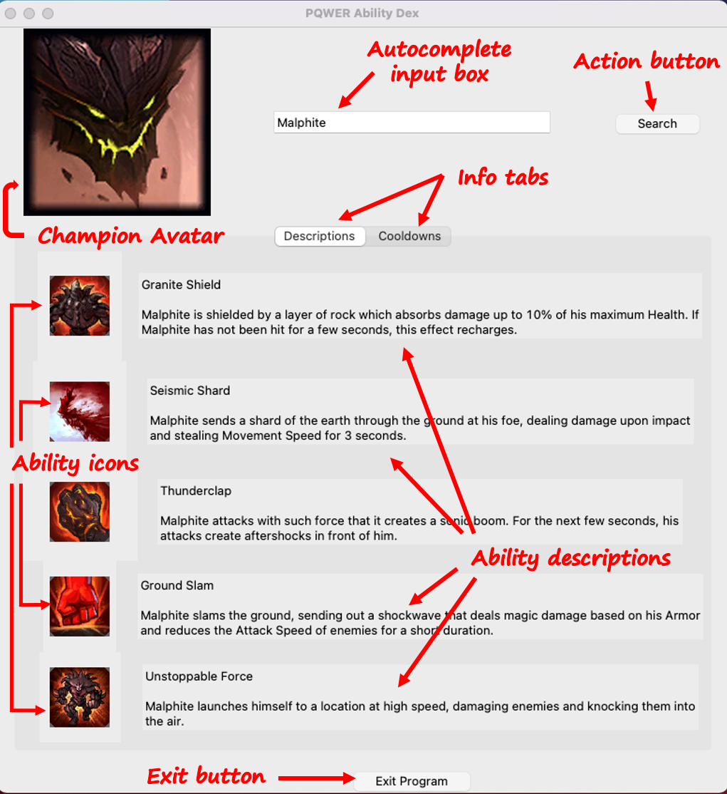

# PQWER Ability Dex

This project utilitizes the champion data provided by the [League of Legends Data Dragon](https://developer.riotgames.com/docs/lol#data-dragon) to create a companion Ability dex application of champion details to assist players. This project employs the python library [**TKinter**](https://docs.python.org/3/library/tkinter.html#module-tkinter) to create an interactive graphical user interface (GUI).
  
**Overview**

 

